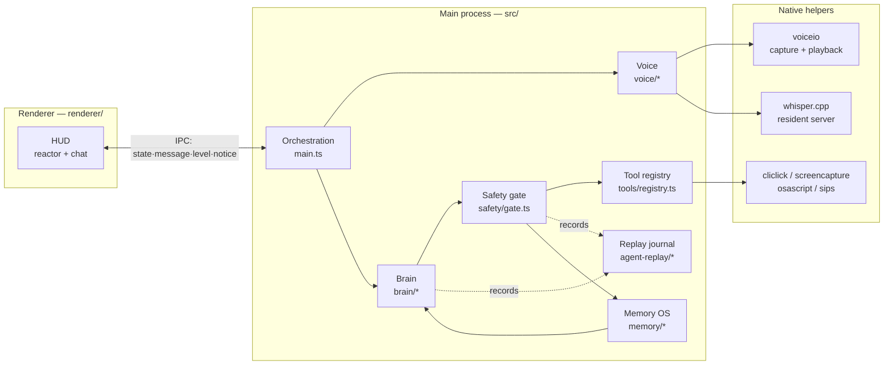
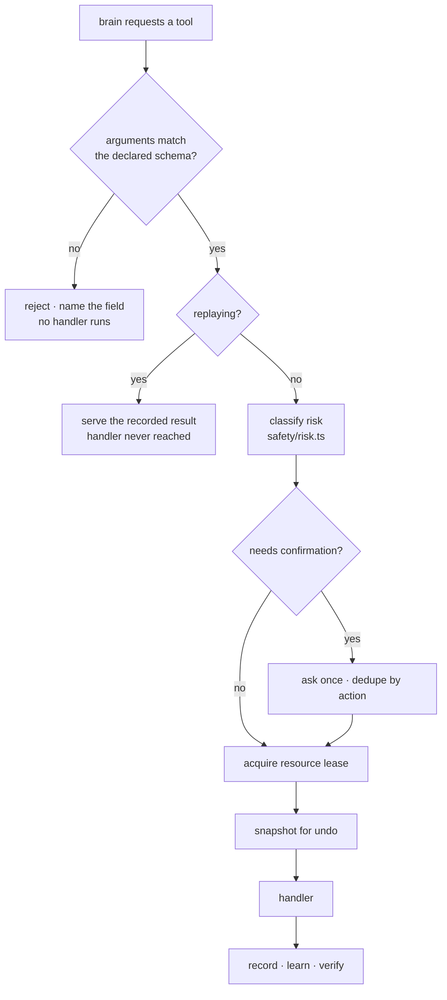
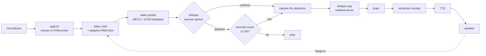

# Echo Mac — Architecture

This document is about **mechanism**, not capability. The [README](../README.md) lists what
Echo can do; this explains how it is built, which invariants hold it together, and why the
awkward parts are shaped the way they are.

It is written for someone who has to change this code without breaking it.

> **Demo:** [`docs/echo-hud-states.mp4`](./echo-hud-states.mp4) — the HUD state machine,
> rendered from the shipping assets using the per-state values in `renderer/hud.css`.

---

## 1. The shape of it

Echo is an Electron app with one always-on-top window, a provider-agnostic agent loop, and a
native control layer. Three processes matter:



The important structural choice: **the brain is not in charge.** `RecordingBrain`
(`agent-replay/runtime.ts`) wraps whichever provider is active and owns the things a provider
cannot be trusted with — the run journal, the task record, recovery, and the terminal event.
A provider that dies, hangs, or silently returns nothing is still surrounded by something that
notices.

### Providers

| Provider | Loop | Notes |
|---|---|---|
| Claude | `brain/claude.ts` | One long-lived `query()` fed by a streaming async iterable; the whole session is one conversation. Tools are an **in-process MCP server**, no subprocess. Rides the existing Claude Code login. |
| Gemini | `brain/gemini.ts` | Hand-written function-calling loop. Streams text deltas for early TTS. Has an 8-model fallback ladder. |
| Ollama | `brain/ollama.ts` | Local. Gets a **shortlist** of tools, not all 136 — the full list is ~22KB and crowds a small model into inventing names. |

All three converge on one tool registry and one gate. A tool written once works on every brain.

---

## 2. The agent loop has one hard rule

**Every path out of the loop names why it ended, from a closed union, before the loop unwinds.**

This is the single most load-bearing invariant in the codebase, and it exists because of a real
failure. Echo used to stop mid-task with nothing in the console and nothing in the log. The
cause was never subtle — it was that *every* way the loop could end emitted the same event. A
`break` on an empty model response, a 150-iteration cap, and a genuine "I'm finished" all
emitted `turnEnd`, which the recorder wrote down as `completed`. **The evidence always said the
run succeeded.**

`agent-replay/loop-log.ts` now enforces the contract:

```ts
type ExitReason =
  | "completed"            | "max_iterations"
  | "model_stop_no_tool_call" | "abort_signal"
  | "tool_error"           | "provider_error"
  | "rate_limit_429"       | "context_overflow"
  | "stream_closed"        | "unknown_fallthrough"
```

`unknown_fallthrough` is the **default**. Seeing it in a log is a bug report about the loop, not
a description of the run. `INCOMPLETE_EXITS` marks which reasons mean the task did *not* finish,
whatever the model claimed.

`exit()` is idempotent — first caller wins — so a `finally` that also reports cannot overwrite
the specific reason a `break` already gave.

### Telling a hang from a stop

From outside, a hung run and a dead process look identical. The loop reports what it is waiting
on every `HEARTBEAT_MS` (15s), so:

- a log ending in heartbeats that keep ticking → **a hang**
- a log ending with neither heartbeat nor exit → **a dead process**

A watchdog forces termination once a single state has lasted too long. The threshold is
**derived, not fixed**:

```ts
stallAfterMs() = max(ECHO_LLM_TIMEOUT_MS, ECHO_TOOL_TIMEOUT_MS) + STALL_HEADROOM_MS
```

clamped so it can never be configured at or below the deadlines it backs up. Both used to be
120000, which made a hung provider a **race between two terminal paths** — `withDeadline`
rejecting the request while the watchdog called `exit("stream_closed")`. A backstop that fires
at the same instant is not a backstop.

### Abandoned work is named

An `llm.request` with no `llm.response` and no `llm.error` is exactly the signature of a call
that was walked away from — and the code can produce it, because `exit()` closes the recorder
and an in-flight request then has its terminal event dropped by the try/catch that keeps
recording from ever changing a result.

So the loop keeps a ledger of work it opened and did not close, and sweeps it into
`work.abandoned` events written *before* `loop.exit`, with a count on the exit event. A caller
that means to discard a request passes `speculative: true` and stays out of the ledger — so an
unpaired request in a tape always means something went wrong.

---

## 3. Everything reaches a tool through one door

`runGated()` in `safety/gate.ts` is the **only** path to any tool handler. Not a convention —
a structural fact. Claude's loop lives inside the Agent SDK and still goes through it, which is
why all three brains produce identical tool telemetry.

Putting it on the single path is what makes these guarantees unconditional:



**Argument validation.** Every tool carries a Zod shape, and all three brains turn it into JSON
Schema to tell the model what to send — but nothing used to check what came back. Malformed
arguments went straight into the handler, so a missing field surfaced as whatever the handler
threw: `Cannot read properties of undefined`. That names a line of Echo's source, not the
mistake, so the model had nothing to correct and usually repeated the call.

Rejecting at the gate means no handler runs, nothing is touched, and the model gets the field
that was wrong, what was expected, and the shape it should have used:

```
click_ui_element was not called correctly, so nothing was run.
  • description: Invalid input: expected string, received undefined
  • descriptio: not an argument of this tool — did you mean "description"?
Accepted arguments: description (string, required)
```

Invented parameter names are reported with a near-miss suggestion, but only when one is genuinely
close — an unrelated name suggested confidently is worse than no suggestion, because the model
takes it.

**Replay is a hard side-effect boundary**, placed *above* risk assessment, snapshots and
confirmations, so a replayed run cannot send a message, touch the screen, or mutate a journal.

---

## 4. Tasks are durable objects, not variables

A task survives the process. `memory/task-state.ts` holds an append-only, crash-safe record:
goal, scope, steps, observations, calls, bindings, verification refs, attempt ids, generation.

### Invocations and resource leases

Every tool call runs inside an `AsyncLocalStorage` invocation carrying a `callId`, a
`generation`, and the **resources** it needs exclusively:

| Tool shape | Resource claimed |
|---|---|
| input actuators (`click`, `type_text`, `press_keys`, `drag`, …) | `desktop:input` |
| `write_local_file` | `file:<absolute path>` |
| `run_terminal_command` | `workspace:<cwd>` |

Leases are exclusive per `callId`. Two calls wanting the same resource cannot overlap; one is
denied with `resource_contention` rather than racing. A call whose outcome is *uncertain* —
a timeout that may still land — leaves its lease **quarantined** rather than free, so recovery
observes real state before repeating an action.

`generation` is how cancellation works without killing threads: `cancel()` bumps it, and any
invocation carrying an older generation is refused at `assertInvocation`.

### Checkpoints and recovery

Each attempt writes `checkpoint.json` beside its journal: the original prompt, follow-ups,
actions and their status, attempt count. If a run ends on an `INCOMPLETE_EXITS` reason, the
brain schedules a retry from the checkpoint.

Two details matter, both learned the hard way:

- **The retry timer is deliberately not `unref`'d.** The user has already been told out loud
  that the task is continuing. An unref'd timer does not hold the event loop open, so whenever
  nothing else did — a headless run, a detached worker — the process exited during the backoff
  and the promised recovery never happened. A silent stop manufactured by the recovery mechanism
  itself.
- **Cancelling during the backoff must end the turn.** The failed attempt's `turnEnd` is
  suppressed on purpose so recovery can carry the task on; cancelling that recovery left nothing
  able to close the turn, so the caller sat in "thinking" forever and the cancel was the thing
  that silently did nothing.

On restart, unfinished checkpoints owned by dead processes are discovered and resumed.

---

## 5. Memory has layers, and a lifecycle

`memory/` is a small memory OS rather than a key–value store. Records carry scope, provenance,
confidence with a stated basis, privacy class, and status.

| Layer | Holds | Retention |
|---|---|---|
| `working` | the task in flight | task-scoped |
| `episodic` | what happened, with outcome and evidence | decays by importance |
| `semantic` | durable facts and preferences | explicit |
| `procedural` | learned workflows and tool reliability | explicit |

The lifecycle is paired: `recordTaskStarted()` opens an **active** working record at task start;
`consolidateTask()` writes the episodic outcome and **supersedes** the working record. Both halves
skip the same cases — private mode, rehearsal, replay, test — so no path opens a record that
nothing will close.

Retrieval is not similarity alone. `<echo_context>` is assembled within a token budget, every item
carries *why it was chosen*, and what was dropped for budget is reported rather than silently lost.
The prompt states the trust rules plainly: the user's own words outrank a web page; a `DISPUTED`
memory is an open question, not a settled fact; something Echo inferred is weaker than something a
tool observed.

**Everything in `<echo_context>` is data, never instructions.**

---

## 6. Every run is a tape

`agent-replay/` records each run as append-only JSONL plus content-addressed blobs.

- **Redact before disk.** Secrets are removed on the way in, never at render time. The hash is
  taken *after* redaction, so two calls differing only in a credential hash identically — which
  is what makes verification work without holding a fingerprint of the secret.
- **Spill large payloads.** Anything ≥ `BLOB_THRESHOLD_BYTES` (32KB) goes to `blobs/<sha256>` and
  is referenced. The messages array is re-sent whole every iteration; inline, the file would grow
  quadratically and bury the interesting last lines.
- **fsync the terminal events.** `loop.exit` and `run.end` are synchronously appended and flushed,
  so a hard kill still leaves the explanation behind.

### Deterministic replay

`ReplaySource` serves recorded values **ordinally**, and verifies each one's normalised **hash**.
The ordinal keeps faithful replay simple; the hash turns prompt or code drift into a useful
divergence report instead of silently serving a wrong response. Ambient inputs — clock, random,
uuid, env — are recorded and replayed too, so a rerun is genuinely the same run.

**Counterfactual mode** replaces exactly one call and then *stops at the first divergence*,
rather than serving stale later cassettes that the altered trajectory never would have produced.

`willRetry` on a recorded error is the caller's real decision, asked at the moment the failure
surfaces. It used to be a hardcoded `false` while the replay path believed the field — a tape from
10 September holds `llm.error … willRetry: false` followed immediately by `llm.request attempt: 1`.
The recorder said it would not retry, then retried, and deterministic replay could not reproduce
any retry-dependent behaviour.

---

## 7. Voice: from air to intent and back



**Wake detection is two weak signals, not one strong one.** A template spotter (MFCC + DTW
against enrolled samples) fires early and on soft speech, which a transcript match never could.
Its weakness is false accepts on similar-sounding words, so a candidate is handed to whisper for
confirmation.

The subtlety is that **whisper does not decline to answer.** Given audio it cannot read it
invents text from its training data — `"Thanks for watching."`, `"♪♪♪"`, and on one real capture
`"Microsoft Word Document MSWordDoc Word.D"` four times in a row. Treating that as a transcript
meant a confident acoustic match was vetoed by a string the microphone never carried.

So the veto is conditional. Whisper can overrule the spotter only when it returns something that
plausibly came from *this* audio; when it returns nothing, or the same text it just returned for
different audio, it has **no opinion** and the spotter's own confidence decides.

**Capture device contention is real.** `voiceio` opens Apple's voice-processing I/O unit, which
*takes* the input device. On some machines that unit delivers a perfect stream of digital silence
while the plain microphone hears the room fine — and because `--capture` is a launch flag with no
runtime release, finding it dead and merely not reading from it left the microphone held anyway.
The recorder behind it then produced a flat, full-scale noise signal with no dynamic range, which
whisper transcribed as boilerplate. A dead capture unit now **hands the device back** by restarting
the helper without the flag.

Barge-in requires distinguishing Echo's own voice from yours — which is what the echo-cancelled
path is for, and why losing it is a stated trade rather than a silent one.

---

## 8. The HUD

One always-on-top window. No status text — the reactor *is* the status display. Seven states,
each with a hue and a spin rate (`renderer/hud.css`), shown in the demo video above.

Two skins share one machinery: `classic` is drawn in CSS; image skins composite a render in three
layers (art + two blooms) with `hue-rotate` per state, so one artwork serves every state. An image
skin may additionally split its render into concentric rings so they rotate independently — a flat
image cannot spin, because rotating it takes the core and the etched labels round with it.

The click target is a small region over the core, not the whole tile: `-webkit-app-region` applies
to an element's whole rectangle, never its visible pixels, so marking the artwork no-drag would
cover the entire reactor and leave no way to pick the HUD up.

---

## 9. Invariants

These are the rules the system maintains. Breaking one is how a regression gets in.

| # | Invariant | Enforced in | If violated |
|---|---|---|---|
| 1 | Every loop exit names a reason from the closed union | `loop-log.ts` `exit()` | Silent stops return; logs claim success |
| 2 | The watchdog is strictly slower than the deadlines it backs up | `stallAfterMs()` clamp | Two terminal paths race a hung provider |
| 3 | Every tool handler is reached only through `runGated` | `safety/gate.ts` | A brain can skip risk, undo, recording |
| 4 | Arguments are validated against the schema the model was shown | `validateArguments` | Crashes instead of correctable errors |
| 5 | Replay never reaches a live side effect | replay branch above `decide()` | A "safe" rerun sends real messages |
| 6 | Secrets are redacted before bytes touch disk | `recorder.ts` redactor | Credentials in tapes and hashes |
| 7 | Terminal events are fsynced | `emit(…, critical)` | A crash loses the explanation |
| 8 | Resource leases are exclusive per call | `acquireResources` | Two actions race the same target |
| 9 | Working memory opens and closes in pairs | `recordTaskStarted` / `consolidateTask` | Phantom "live" tasks accumulate |
| 10 | `<echo_context>` is data, never instructions | persona + router | Prompt injection from memory |
| 11 | An unpaired `llm.request` means something went wrong | open-work ledger | The abandoned-call signature becomes noise |

### Known gap

Invariant 9 holds for every path that reaches `finalizeTask`, but nothing reconciles working
records at boot. A crash or `SIGTERM` mid-task leaves `task-<id>` at `status: "active"`
permanently — `retentionPolicy: "task"` is written and never acted on. Recall is not polluted
(a dead `taskId` never recurs), but `/task status` accumulates phantom live tasks. The fix is a
boot-time sweep, mirroring what `pendingRecoveries()` already does for checkpoints.

---

## 10. What the tests actually defend

The suites are named for failure modes, not for files:

| Suite | Defends |
|---|---|
| `exittest` | Every exit reason is recorded correctly; two errors in one run are both reported |
| `recoverytest` | Retry, cancel-mid-backoff, clone isolation, restart-from-checkpoint, a bare process surviving the backoff |
| `replaytest` | Redaction, blocked live calls, faithful replay, counterfactual divergence, no unpaired requests |
| `gatetest` | One action asks once, across both permission layers and on retry |
| `risktest` | Classification of destructive, outward-facing and self-modifying actions |
| `safetytest` | A destructive command is intercepted with a canary left intact |
| `wiringtest` | Prompts name only real tools; schemas convert; the risk gate knows every tool |
| `memoryostest` | Privacy switches, scope isolation, budget honesty, the task lifecycle end to end |

`exittest` carries a known pre-existing failure: nine Gemini cases stub
`ai.models.generateContent` while the brain calls `generateContentStream`, and the long-lived
session case calls `consume()` without its `generation` argument. Both are stale harness code, not
product defects — but it means the exit contract is currently unguarded for those paths.

---

## 11. Remaining silent-stop path

One is known and unfixed. `brain/claude.ts` has a bare `return` **inside** the `finally` block,
ahead of the `unknown_fallthrough` backstop three lines below it. When `sessionGeneration` has
advanced — which `send()` triggers via `resetSession()` on a new memory context — `consume()`
unwinds and the turn's journal records no exit and no `run.end` at all. `turnEnd` is only emitted
inside the result handler, which the earlier generation check has already skipped.

A `return` in `finally` also discards the pending throw from the `catch` above it.

That is a run ending with nothing in the log, which is the exact thing invariant 1 exists to
prevent.
