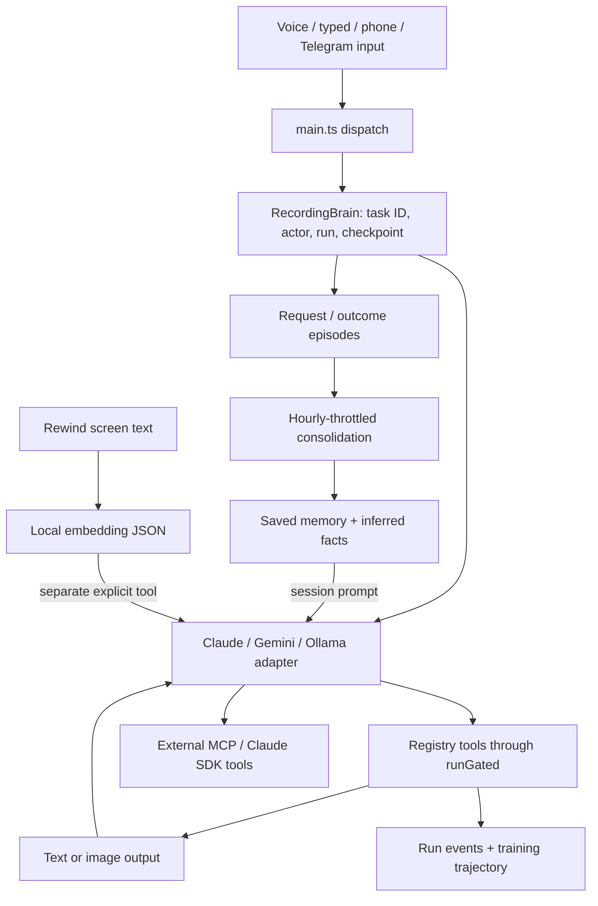

# Echo Memory OS — phase-one architecture report

**Date:** 12 September 2026. **Scope:** inspect and design only. No Echo implementation, configuration changes, migration, new database, or application launch.

**Recommendation:** evolve Echo’s existing memory and recovery code into one coordinated memory service. Keep the three model adapters, registry, safety gate, JSON/JSONL persistence, local embeddings, and recovery machinery. The first priority is trustworthy task identity, scoped state, and typed outcomes. Adding another retrieval database would leave the principal failures intact.

The five proposed layers are useful distinctions, but they should share an object contract, router, write policy, and deletion path. A transcript is evidence; a completed model turn is an execution event; neither alone proves that an autonomous task succeeded.

## 1. Inspection basis and limits

The primary application is `Echo Mac/`, an Electron/TypeScript application. Its Git working tree already contains substantial modified and untracked work, including cognition and replay code. This report describes the **current working files**, not just the initial commit `ddef9a4`. Existing changes were preserved.

`Echo Mac/package.json` declares the Claude Agent SDK, Google GenAI SDK, MCP SDK, Zod, Electron, TypeScript/esbuild and local ONNX support. No implemented SQLite driver or external memory database dependency was found in that manifest. DeepakLLM under `deepakllm/` is an existing local-model training/export path; training a model is not a replacement for inspectable runtime memory.

The checked configuration selects Gemini, with model strings `gemini-3.7-flash`, `claude-sonnet-5`, and `llama3.2:3b`. These are configuration values, not a claim that each endpoint/model is available. Learning and screen capture are enabled in the inspected configuration; shadow, ghost, and auto-debug helpers are disabled. Model APIs were not contacted.

Inspection covered source, tests, dependency manifests, selected non-secret configuration fields, and aggregate storage sizes. Private memory contents, screenshots, credentials, and historical task payloads were not reproduced in this report. The separate browser extension was inspected to establish its boundary; see §12.

Available-tool discovery found no callable ToolSearch/Ruflo tools, so the requested repository integration could not be invoked. Local inspection and parallel read-only audits supplied the evidence instead; no plugin or service was installed.

Validation performed against temporary directories:

- Existing [src/_episodictest.ts](</Users/thedeepakreddy/J.A.R.V.I.S/Echo Mac/src/_episodictest.ts>): **47/47 checks passed**.
- Existing [src/_historytrimtest.ts](</Users/thedeepakreddy/J.A.R.V.I.S/Echo Mac/src/_historytrimtest.ts>): **20/20 checks passed**.
- Synthetic consolidation probe: three identical requests over three days, distributed across two fictional projects, promoted one fact with support 3. Re-consolidating with the clock advanced one year left confidence at **0.375**, and the fact remained prompt-visible.

The remaining defects below are established by source paths; concurrency scenarios describe possible executions, not incidents observed in personal run logs. Passing the existing tests does not establish end-to-end memory correctness. No full application, live GUI, or cloud test was run.

## 2. Current model, memory, and tool flow



### Models and session state

[src/brain/index.ts:23](</Users/thedeepakreddy/J.A.R.V.I.S/Echo Mac/src/brain/index.ts:23>) chooses a provider and wraps it in `RecordingBrain`. Claude uses the Agent SDK and an in-process MCP server for Echo tools ([src/brain/claude.ts:107](</Users/thedeepakreddy/J.A.R.V.I.S/Echo Mac/src/brain/claude.ts:107>)); Gemini runs its own model/tool loop and connects configured external MCP servers ([src/brain/gemini.ts:90](</Users/thedeepakreddy/J.A.R.V.I.S/Echo Mac/src/brain/gemini.ts:90>)); Ollama uses its local chat endpoint and a filtered tool list ([src/brain/ollama.ts:26](</Users/thedeepakreddy/J.A.R.V.I.S/Echo Mac/src/brain/ollama.ts:26>), [src/brain/localtools.ts:157](</Users/thedeepakreddy/J.A.R.V.I.S/Echo Mac/src/brain/localtools.ts:157>)). Ollama currently executes local registry tools, without the same external MCP integration as Gemini/Claude.

[src/brain/types.ts:28](</Users/thedeepakreddy/J.A.R.V.I.S/Echo Mac/src/brain/types.ts:28>) builds a shared system prompt from the persona, `recallForPrompt()`, and `factsForPrompt()`. Gemini builds it in its constructor; Ollama stores it as its initial system message; Claude builds it when its SDK session starts. This fixes an earlier absence of memory on some providers, but it is **session-time loading**, not retrieval for the current goal or step.

Gemini retains mutable `contents`; Ollama retains mutable `messages`; Claude delegates conversation history to the SDK. Gemini drops older image payloads through [src/brain/history.ts:45](</Users/thedeepakreddy/J.A.R.V.I.S/Echo Mac/src/brain/history.ts:45>), preserving text. This bounds screenshot retention in context, not the accumulating task facts/text. Provider switching constructs a fresh brain ([src/main.ts:982](</Users/thedeepakreddy/J.A.R.V.I.S/Echo Mac/src/main.ts:982>)); there is no provider-neutral task context packet that explicitly transfers verified facts, decisions, and artifact bindings.

[src/main.ts:1378](</Users/thedeepakreddy/J.A.R.V.I.S/Echo Mac/src/main.ts:1378>) derives a project from the frontmost window, then assigns `projectHint` to the returned wrapper at line 1396. `RecordingBrain` does not forward that property to the inner Claude instance. Gemini/Ollama already built their prompts with an undefined project. A title-based hint is also not a stable project identity or an authorization boundary.

### Tool execution and recovery

[src/tools/registry.ts:119](</Users/thedeepakreddy/J.A.R.V.I.S/Echo Mac/src/tools/registry.ts:119>) defines outputs as `{text?, image?}`. Local tool execution normally passes through [src/safety/gate.ts:157](</Users/thedeepakreddy/J.A.R.V.I.S/Echo Mac/src/safety/gate.ts:157>), combining risk decisions, snapshots, observation, recording, and training capture. Gemini adapts external MCP tools into that route. Claude SDK-native/external tools use SDK permission handling; their result observation is not equivalent to the local gate’s coverage.

Echo already has a strong recovery foundation:

- [src/agent-replay/context.ts:19](</Users/thedeepakreddy/J.A.R.V.I.S/Echo Mac/src/agent-replay/context.ts:19>): AsyncLocalStorage carries actor, logical task ID, recorder, and loop.
- [src/agent-replay/recovery.ts:25](</Users/thedeepakreddy/J.A.R.V.I.S/Echo Mac/src/agent-replay/recovery.ts:25>): durable checkpoint contains the original goal text, follow-ups, actor, provider/model, attempts, lifecycle, and action summaries.
- [src/agent-replay/recorder.ts:101](</Users/thedeepakreddy/J.A.R.V.I.S/Echo Mac/src/agent-replay/recorder.ts:101>): JSONL events, payload blobs, sequence/timestamp metadata, and durable terminal events.
- [src/agent-replay/runtime.ts:623](</Users/thedeepakreddy/J.A.R.V.I.S/Echo Mac/src/agent-replay/runtime.ts:623>): creates/reuses tasks, establishes run context, records inputs, and initiates recovery.

These are more than chatbot history, but they do not yet constitute shared working state. Tools lack an immutable invocation context, namespaced handoff data, revisioned commits, and verified task completion criteria.

### Persistence inventory

Paths below are current defaults; supported environment overrides may relocate them. Sizes are approximate metadata snapshots, not measurements of retrieval speed.

| Purpose | Current source and data path | What it holds / limitation |
|---|---|---|
| Explicit saved memory | [src/memory/store.ts:18](</Users/thedeepakreddy/J.A.R.V.I.S/Echo Mac/src/memory/store.ts:18>); `~/.jarvis/memory/memories.jsonl` | ID, ISO time, type, project, text; append/tombstone. About 13 KB. No confidence, provenance, validity interval, or general status. |
| Episodic memory | [src/cognition/episodic.ts:45](</Users/thedeepakreddy/J.A.R.V.I.S/Echo Mac/src/cognition/episodic.ts:45>); `~/.jarvis/episodic/{episodes,access,facts}.jsonl` | Episodes have importance/access metadata; facts have confidence/support/source episode IDs. Directory about 80 KB. |
| Active task / replay | `src/agent-replay/*`; app `runs/` | Per-attempt checkpoint, events, payloads; about 52 MB. Not a single canonical shared state object. |
| Training trajectories | [src/learn/trajectory.ts](</Users/thedeepakreddy/J.A.R.V.I.S/Echo Mac/src/learn/trajectory.ts>); `~/.jarvis/trajectories/` | Commands, steps, observations, outcomes, optional screenshots; about 53 MB. Training examples are not automatically executable procedures. |
| Named skills | [src/frontier/skills.ts:103](</Users/thedeepakreddy/J.A.R.V.I.S/Echo Mac/src/frontier/skills.ts:103>); production registry supplies app root, yielding app `skills/skills.json` | Named tool/argument recipes; source default without a supplied root is `~/.jarvis/skills/skills.json`. |
| Demonstrations / reflexes | [src/frontier/demonstrate.ts:35](</Users/thedeepakreddy/J.A.R.V.I.S/Echo Mac/src/frontier/demonstrate.ts:35>), `replay.ts`, `reflex.ts:6`; `~/.jarvis/workflows/<slug>.json`, `~/.jarvis/reflex/cache.json` | UI workflows and exact-command reflexes; separate formats and execution paths. |
| Undo evidence | [src/frontier/journal.ts:20](</Users/thedeepakreddy/J.A.R.V.I.S/Echo Mac/src/frontier/journal.ts:20>); `~/.jarvis/journal/actions.jsonl` and `files/` backups | Reversal metadata and original file copies; preserve as evidence, with deletion/retention coverage. |
| Rewind history | [src/frontier/history.ts:38](</Users/thedeepakreddy/J.A.R.V.I.S/Echo Mac/src/frontier/history.ts:38>), [src/tools/rewind.ts](</Users/thedeepakreddy/J.A.R.V.I.S/Echo Mac/src/tools/rewind.ts>); app `rewind/YYYY-MM-DD.jsonl` | Timestamped screen text, 90-day shard retention; about 17 MB. Separate from explicit saved memory. |
| Screen embeddings | [src/tools/long_term_memory.ts:7](</Users/thedeepakreddy/J.A.R.V.I.S/Echo Mac/src/tools/long_term_memory.ts:7>); app `long_term_memory.json` | Timestamp/text/vector, newest 1,000 records; about 16.3 MB. Rewritten as a whole JSON array. |
| Deliberate scans | [src/frontier/scan.ts:32](</Users/thedeepakreddy/J.A.R.V.I.S/Echo Mac/src/frontier/scan.ts:32>); `~/.jarvis/scans/` | Text, screenshots, source path, optional vector; about 1.7 MB. Explicit capture, currently permanent. |
| File search index | [src/frontier/diskindex.ts:258](</Users/thedeepakreddy/J.A.R.V.I.S/Echo Mac/src/frontier/diskindex.ts:258>); `~/.jarvis/diskindex/` | Existing chunk JSONL, binary vectors, file metadata; about 1.3 MB. Source-document search, not authoritative user facts. |
| Command prediction | [src/brain/prefetch.ts:20](</Users/thedeepakreddy/J.A.R.V.I.S/Echo Mac/src/brain/prefetch.ts:20>); `prefetch.json` in supplied app root | Command counts and transitions, independent of memory/forget commands. |

[src/memory/vector-store.ts:30](</Users/thedeepakreddy/J.A.R.V.I.S/Echo Mac/src/memory/vector-store.ts:30>) is a scaffold: its SQLite initialization does not initialize a database and semantic search returns placeholder text. No production imports were found. It must not be counted as an implemented database or used as evidence that SQLite is already required.

### What learning currently means

The live recording wrapper calls `rememberRequest()` and `rememberOutcome()` (`runtime.ts:670`, `:697`). The outcome bridge invokes consolidation at most hourly ([src/cognition/outcomes.ts:83](</Users/thedeepakreddy/J.A.R.V.I.S/Echo Mac/src/cognition/outcomes.ts:83>)). Episodic `retrieve()` already combines relevance, recency, importance, and usage, but no production caller routes ordinary task retrieval through it. The model receives only the consolidated-facts prompt block.

Saved skills and demonstrations exist. `saveReflex()` has no production caller, so successful tasks do not automatically become validated reflexes. Dreaming creates a separate rehearsal brain ([src/frontier/dreamer.ts:90](</Users/thedeepakreddy/J.A.R.V.I.S/Echo Mac/src/frontier/dreamer.ts:90>)); it is not a task consolidation engine. Do not equate rehearsal, repeated requests, or training export with learning a reliable workflow.

## 3. What is failing or missing today

| Priority | Finding and exact files | Impact / evidence level |
|---|---|---|
| P0 | Global translation `pending`/language in [src/frontier/translate.ts:200](</Users/thedeepakreddy/J.A.R.V.I.S/Echo Mac/src/frontier/translate.ts:200>); registry stashes at `:926`, consumes at `:947`. `save_last_scan` uses global latest scan (`registry.ts:1867`, `scan.ts:453`). | Main/clone flows can overwrite each other’s handoffs or save the wrong scan. Static, concrete interleaving risk. |
| P0 | Resolved failures look successful: `registry.ts:1437` terminal errors and `:1457` write errors become ordinary text; `gate.ts:246` marks resolved outputs successful. MCP flattening loses `isError` (`brain/mcp.ts:183`, `:258`). | Reliability and procedure learning would be trained on incorrect outcome labels. Static defect. |
| P0 | `run_skill` calls raw `tool.handler()` and discards outputs (`registry.ts:219–237`). | Nested steps miss common execution hooks; missing tools are skipped, textual failures can still produce “Ran.” High-risk plans are screened and deferred; this finding does not imply those deferred plans autoexecute. |
| P0 | `forget` only reaches `memory/store.ts` (`registry.ts:680`); query deletion caps at 50 matches (`store.ts:88`). | Episodic facts, vectors, scans, trajectories, prompts, and caches survive; deleted information can reappear. Scope and completeness are not reported. |
| P1 | `memory/recall.ts:28` includes preferences from every project; nonpreferences are filtered separately. Empty-query recall ignores project (`:66`). Project hint is assigned to the wrapper, not the inner adapter. | Wrong-project facts can influence an unrelated task. Static defect. |
| P1 | `episodic.ts:442` groups by text signature across projects; known facts are skipped at `:462`; `factsForPrompt()` at `:513` does not rescore age or filter project. | Cross-project evidence is pooled and confidence freezes. **Reproduced with synthetic data**, including stale fact remaining visible one year later. |
| P1 | Static prompt loading in `brain/types.ts:28`, `gemini.ts:117`, `ollama.ts:51`, `claude.ts:163`. | New facts, corrections, and deletions do not consistently refresh session memory. Retrieval is not driven by goal/step. |
| P1 | `runtime.ts:670–697` omits project/task/turn provenance from episode writes. Every run exit is recorded before logical-task recovery finishes. No replay/rehearsal guard at those writes. | Retries, generated worker instructions, and rehearsals can become apparent independent support. A failed attempt is conflated with a failed overall task. |
| P1 | Model text-only stop maps to completed (`gemini.ts:479`, `ollama.ts:201`); `outcomes.ts:58` renders non-incomplete reasons as “Finished the task.” Main also labels terminal turns provisional success (`main.ts:926`). | There is no deterministic proof that requested artifacts or external effects exist. Preserve execution termination separately from task achievement. |
| P1 | Checkpoint completion matches the latest started action by name (`runtime.ts:445`), while `RecoveryAction` lacks call ID (`recovery.ts:17`). | Overlapping invocations of the same tool can settle the wrong action. Existing event call IDs should be reused end-to-end. |
| P1 | Trajectory recording has process-global turn/previous/observation (`learn/trajectory.ts:128`), despite ordered writes. | Clone results can attach to the main task’s training example. Disk ordering does not provide actor isolation. |
| P1 | MCP clients have global ownership (`brain/mcp.ts:198`); connecting calls `closeMcpServers()` at `:228`. | Starting/stopping one Gemini brain may invalidate another’s tool handles. Static lifecycle risk. |
| P1 | Shared desktop has no lease around observe–act–verify. Approval dedupe uses tool+input rather than task/resource (`safety/gate.ts:49`, `:96`). | Correct memory patches alone cannot prevent cursor/focus races or cross-task approval reuse. |
| P2 | Embedding sweep takes only newest 10 rewind rows (`long_term_memory.ts:55`), every five minutes (`main.ts:1516`), with no durable cursor. Search always returns top five by cosine (`:94`). | Backlogs/outages lose coverage; low-relevance results still surface; no temporal/scope filtering. Whole-file asynchronous updates can overlap or be interrupted during rewrite. |
| P2 | Legacy store and episodic writes store raw text; recorder redaction does not govern all checkpoint/trajectory/prefetch paths. Scans are permanent. | There is no common privacy, export, retention, or deletion policy. See §10; do not describe “local” as meaning “never sent to a model.” |

Additional bounded gaps: one pending confirmation is supported ([src/safety/confirm.ts:14](</Users/thedeepakreddy/J.A.R.V.I.S/Echo Mac/src/safety/confirm.ts:14>)), so concurrent requests may be denied as busy; this is not evidence that a tool is unreliable. Ollama’s advertised tool subset lacks forget/inspection/skill commands. Claude SDK tool-result coverage is incomplete relative to local tools. These must be represented honestly in the new contracts.

Deletion matching itself needs repair: a query with only filtered stop words, such as a query argument of “me,” falls back to recent records (`memory/store.ts:114–116`) and can forget unrelated items. Public recall does not expose IDs even though the store supports exact-ID deletion. Reject empty semantic targets and use explicit scoped IDs after matching.

## 4. Proposed five-layer design

| Layer | Store / responsibility | What qualifies | Retrieval behavior |
|---|---|---|---|
| **Working task memory** | Extend recovery into canonical `TaskState`. | Goal, constraints, plan, decisions, observations, exact artifact handles, pending calls, blockers, verification. | Always supply relevant active state; never compete with optional historical recall. |
| **Episodic memory** | Evolve `cognition/episodic.ts` and outcome bridge. | One logical-task record with attempt links, actions, outcome, evidence, failures/recovery, and user correction. | Similar goals, resources and failure signatures; historical time queries; successful and unsuccessful examples. |
| **Semantic memory** | Unify explicit store and inferred fact projections under common objects. | Stable user facts/preferences and project decisions, with canonical keys, scope, source and validity. | Only eligible facts that affect this task; current user instruction has precedence. |
| **Procedural memory** | Wrap existing skills/demonstrations with versioned metadata. | Parameterized workflows with preconditions, steps, resource needs, postconditions, evidence, and rollback/fallback information. | Match task requirements and environment; return a candidate plan, then execute through existing gates. |
| **Tool memory** | Derive from typed invocation and verification events. | Tool/context reliability, error classes, latency, last validation, supported workarounds. | Consult before tool selection and after failure; rank equivalent tools without changing authorization. |

Scans, screen history, and indexed files remain **evidence collections**. A page stating a preference is not a user preference. A cached result is not evidence that a new action happened. The router can retrieve those sources without promoting their contents into stable memory.

## 5. Memory object contract

The following is a proposed contract, not implementation code. Keep one common envelope and small layer-specific payloads; do not force images or full transcripts into every object.

```ts
type MemoryObject = {
  schemaVersion: 1;
  id: string;
  revision: number;
  layer: "working" | "episodic" | "semantic" | "procedural" | "tool";
  kind: string;
  key?: string;                    // e.g. project:alpha/package-manager
  summary: string;
  payloadRef?: string;             // local artifact/blob, not arbitrary executable input
  confidence: number | null;      // evidence support; null = unknown
  confidenceBasis: string;
  importance: number;              // distinct from confidence and retrieval relevance
  status: "candidate" | "active" | "disputed" | "superseded" | "expired" | "deleted";
  scope: {
    principalId: string;
    workspaceId?: string;
    projectId?: string;
    taskId?: string;
    resourceIds?: string[];
    allowedActors?: string[];
  };
  source: {
    kind: "user" | "tool" | "document" | "inference" | "import";
    origin: "live" | "rehearsal" | "replay" | "legacy_unknown";
    actorId?: string;
    taskId?: string; runId?: string; turnId?: string; callId?: string;
    evidenceRefs: string[];
    derivedFromIds: string[];
    trust: "user_asserted" | "observed" | "external" | "inferred" | "legacy_unknown";
    modelOrToolVersion?: string;
  };
  createdAt: string;               // when Echo stored it
  observedAt: string | null;       // unknown for legacy records lacking observation time
  validFrom?: string; validTo?: string;
  lastVerifiedAt?: string; expiresAt?: string;
  timezone?: string;
  supersedesIds: string[];
  contradictsIds: string[];
  privacy: {
    sensitivity: "ordinary" | "personal" | "sensitive";
    modelAccess: "local_only" | "configured_providers";
    retentionPolicy: string;
    trainingAllowed: boolean;
  };
};
```

Do not generate plausible provenance when migrating old records. Preserve the original ID, timestamp and project and mark unavailable source/verification as unknown. A model’s own confidence estimate must not activate a memory.

Confidence describes evidence for the particular claim: “user explicitly requested pnpm for project Alpha” can have strong support as a preference; “pnpm is installed” requires a tool observation. Recurrence is not independent corroboration when it comes from retries, copied pages, the model’s own output, or recall of the same object.

Semantic payloads should contain subject/predicate/value so conflicts are addressable. Episodic payloads need `executionStatus`, `taskOutcome`, `verificationRefs`, `attemptIds`, and `userFeedback` separately. Procedural payloads need versioned parameters/preconditions/steps/postconditions and validation counts. Tool payloads need error categories, sample counts, environment fingerprint, and recent observations.

## 6. Memory router and relevance scoring

Place routing in `src/memory/router.ts`, behind a single service used by every provider and by the existing recall tools. Keep `buildSystemPrompt()` for stable persona; attach a refreshable, clearly delimited memory/context packet on task start, relevant follow-up, step transition, recovery, provider switch, and memory invalidation.


**Router input:** logical task/actor ID, explicit project/resource scope, current goal and step, entities, requested time interval, current timestamp/timezone, provider privacy eligibility, candidate tools, task-state revision, and token budget. Frontmost window is an observed resource hint, never the sole scope decision.

**Eligibility comes before ranking:** exclude deleted/expired/superseded active facts, unauthorized scope, disallowed model export, incompatible procedure versions, and observations outside validity. Disputed facts appear as conflicts only when relevant, never as settled instructions. Historical queries may retrieve superseded facts valid at the requested time, labeled historical. Deleted content remains unavailable.

Candidate sources: exact IDs/keys and entities first; Unicode-aware lexical retrieval second; optional existing local embeddings third. Route “continue the task” primarily to working state; “what failed last time” to episodes/tool history; “my preferred setup” to semantic memory; “do this like last time” to procedures plus their evidence. Large scans/indexed files remain opt-in to the current question’s retrieval path.

A proposed initial ranking, with each component normalized to 0–1:

`score = .45 relevance + .15 applicability + .10 confidence + .10 temporalFit + .10 evidenceQuality + .05 importance + .05 demonstratedUsefulness − penalties`

- **Relevance:** goal/step intent, exact entity/argument matches, lexical match, and optional embedding match. Start with intent 0.30, entities 0.25, lexical 0.30, embeddings 0.15; renormalize available signals. Require a relevance floor before recency/importance can elevate an item. Exact requested IDs bypass discovery, not privacy or validity checks.
- **Applicability:** compatible project/resource/task class and procedure preconditions. Scope is still a hard eligibility rule; this term ranks permitted matches.
- **Confidence/evidence:** source support and verified outcomes, with unknown coverage labeled. An episode about a failed workflow remains valuable when the query is about avoiding that failure.
- **Temporal fit:** current validity for action; proximity to the requested historical interval for past questions. Retrieval age is not the same as real-world validity.
- **Usefulness:** evidence that an item helped a verified task, not the number of times the router displayed it. Keep access counts for diagnostics without self-reinforcing truth.
- **Penalties:** redundant sources, weakly resolved identity, stale environment and unsupported inference. Unresolved contradictions are handled explicitly, not averaged into a “truth score.”

These weights are design defaults to evaluate, not measured optimums. Example: an old “npm” memory may have higher cosine similarity than a current project decision to use pnpm. The old superseded decision is ineligible as current guidance; the explicit project decision wins. A browser selector with many old successes does not outrank a newly verified accessibility path if the application version changed.

**Packet output:** selected object IDs/revisions, concise evidence-backed content, why each item matters, component scores, excluded-conflict notes, refresh/expiry time, and provenance references. Keep external content as quoted evidence; never transform it into system instructions. Only authenticated user preferences can act as standing preferences, subordinate to the current task and existing policy.

Start with a configurable historical-memory budget around 1,000–1,500 tokens for cloud adapters and a smaller local-model budget. Measure before expanding. Pin goal, constraints, in-flight calls and critical artifact IDs separately; reduce optional history first. Cache by task-state revision + memory revision + scope + query + provider eligibility, with expiry and deletion invalidation. Retrieval must work without Ollama embeddings; embedding work must not delay the first action.

## 7. Shared task state that tools cannot overwrite

Extend the existing `taskId` and AsyncLocalStorage context. Do not introduce a second global “current task.” One Electron-main coordinator owns authoritative state, even when replay diagnostics are disabled.

```ts
type TaskState = {
  taskId: string; parentTaskId?: string;
  ownerActorId: string; revision: number; generation: number;
  goal: string; constraints: string[]; scope: object;
  status: "running" | "waiting" | "verifying" | "completed" |
          "failed" | "cancelled" | "partial";
  steps: Record<string, { ownerActorId: string; dependsOn: string[];
                         status: string; verificationRefs: string[] }>;
  observations: Record<string, { sourceCallId: string; observedAt: string;
                                resourceId: string; resourceVersion?: string;
                                expiresAt?: string; valueRef: string }>;
  calls: Record<string, { stepId: string; status: string; resultRef?: string }>;
  bindings: Record<string, string>; // e.g. translationInput -> observation ID
  decisions: object[]; artifacts: object[]; blockers: object[];
  childTaskIds: string[]; approvalRefs: string[];
  createdAt: string; updatedAt: string;
};
```

**Invocation contract:** capture immutable `taskId`, `actorId`, `stepId`, `callId`, generation, base revision and resource identity when dispatching. Tools receive a read-only snapshot and return an immutable result plus a typed patch. Never resolve a late result’s owner via the mutable AsyncLocalStorage `successor` chain.

**Commit rule:** coordinator validates ownership, generation, source references and `expectedRevision`; serializes accepted changes; durably appends one event; updates the state projection; then acknowledges. A stale patch receives a conflict. Disjoint fields may be rebased after validation; conflicting fields must be reread/replanned. No last-writer-wins replacement of the task object. Results append under unique call IDs; only the coordinator changes goal, lifecycle, approval and verification state.

**Failure/recovery:** carry one call ID through gate, replay, checkpoint, result, patch and memory provenance. Deduplicate repeated commits by that ID. Increment generation on cancellation or replacement. Late completions are recorded against the original invocation but cannot mutate a newer generation. A timeout means the external effect may be uncertain; inspect before retrying. Local commit deduplication does not promise exactly-once execution in an external application.

Reuse `RecoveryCheckpoint` as a compatibility/recovery projection referencing the canonical task revision. Retain an authoritative task event journal and atomic snapshot under `~/.jarvis/memory/tasks/<taskId>/`; existing `runs/` remains per-attempt diagnostics. Share recorder serialization/blob utilities, rather than maintaining two independent state machines. Essential task persistence must work with `ECHO_LOG=0`. If it cannot persist, pause dependent mutations instead of claiming recoverability. Append/fsync before acknowledgement and recover incomplete tail records; temp-file rename alone does not guarantee all power-loss durability.

**External resource coordination:** add a lease for `desktop:input` spanning each observe–act–verify unit and narrower file/resource leases where needed. Recheck lease ownership immediately before dispatch. Release idle/model waits only after owned handlers have completed or cancellation is confirmed; reacquire and re-observe before acting. A timed-out handler can still affect the Mac: quarantine its resource until reconciliation instead of granting another actor a conflicting lease. Detached worktrees in `frontier/parallel.ts` remain useful for file isolation. Memory revisions do not prevent another actor changing the real window.

**Concrete translation fix design:** reading screen A returns `translationInputId=A`, tied to task, window/screen fingerprint, language and capture time. A clone’s screen B returns a different ID. Rendering must name A and pass resource freshness validation. If focus/content changed, return stale-observation and recapture. `save_last_scan` similarly resolves a task binding to an exact `scanId`, never the globally latest item.

Child agents receive explicit parent task/step links and only the required context subset. They publish result/artifact references to their own child state; parent adoption is a validated coordinator patch. A free-text instruction to “remember your report” is not the result-delivery protocol.

## 8. Write policies, outcomes, and consolidation

| Input/event | Immediate write | Durable promotion |
|---|---|---|
| User supplies task requirement | Working constraint with source turn. | Semantic only if explicitly lasting, or a supported candidate pending review. Task-specific is the default scope. |
| User says “remember this preference” | Validated semantic record with exact scope and user provenance. | Active within that scope; do not ask again for an already explicit instruction. Sensitive retention requires explicit intent. |
| Tool returns data | Immutable observation/result with freshness and call ID. | Stable fact only after verification and relevance policy. |
| Webpage/OCR/scan | External evidence reference. | Never a user preference or executable instruction merely because its text says so. |
| Model inference | Candidate, source-linked, marked inferred. | Promote only on sufficient independent evidence; model self-repetition supplies none. |
| Task attempt ends | Execution/attempt event with reason. | Do not finalize the logical task or count retries as independent experience. |
| User correction/undo | Superseding constraint/fact plus outcome feedback. | Reevaluate dependent facts/procedures and reopen verification when needed. |
| Rehearsal/replay/training export | Separate origin tag/namespace. | Exclude from real-world success statistics and user-preference support by default. |

Use a common `MemoryService.proposeWrite/commit` boundary with schema validation, source checks, redaction, deduplication, scope assignment, policy and receipt. Tools cannot append directly to stores after migration. The model may propose content, but the service determines eligibility, status and supported confidence. Avoid mechanically storing all personal life updates; the current broad persona instruction at `brain/types.ts:255` needs to match the actual policy.

**Typed tool result:** `success | failed | denied | cancelled | timeout | uncertain | partial`, with structured data, error category, retryability, duration, tool/server/schema version, call/task/step IDs and `verification: unverified | verified | contradicted`. Distinguish invalid arguments, authentication, rate limiting, unsupported capability, resource contention, tool bug, service outage and user denial. A handled exception returned as text is still failure. Unknown SDK coverage is unknown, not success.

**After a logical task:**

1. Settle calls, retaining uncertain external effects; evaluate explicit postconditions/artifact checks. Separate “answered a question” from “performed an action.”
2. Write one episode with goal, scoped resources, attempts, actions/result refs, outcome, verification and outstanding work. Partial/failed/cancelled tasks are useful episodes too.
3. Run lightweight deterministic consolidation: deduplicate, refresh support, expire volatile facts, link contradictions, and update tool statistics. Queue heavier work outside the latency-sensitive loop.
4. Propose semantic candidates only from supported lasting information. Recompute existing facts; do not skip known signatures. Group by canonical claim + scope and count distinct source events/tasks.
5. Propose a procedure from verified repeated workflows, or a user-taught demonstration. Parameterize task values, include pre/postconditions, preserve failed alternatives. One success makes a candidate; activation requires user teaching or repeated independent verified successes in a compatible environment.
6. Commit promotions with `derivedFromIds`, consolidation version and unique job key. Rerunning a job must not duplicate support. Atomically invalidate affected context packets.

User corrections arriving later create an outcome revision; they can demote a procedure and retract inferred facts. Retrieval frequency must not make a wrong memory harder to correct.

**Tool reliability:** keep contextual recent and lifetime counts, verified successes/failures, uncertainty/partial/denial counts, latency and last validation. A smoothed estimate such as `(verifiedSuccesses + 1)/(verifiedSuccesses + verifiedFailures + 2)` is a starting point; always show sample count/coverage and do not present it as calibrated confidence. Use environment/version-specific recent evidence, and treat sparse data as unknown. Repeated failures trigger bounded alternatives/revalidation, not invented workarounds or bypassed safety gates.

## 9. Contradictions and time

Use `(principal, project/resource scope, subject, predicate, validity interval)` as a conflict key. Different project preferences and facts valid in different periods can coexist. An explicit current user correction supersedes an older preference in the overlapping scope, while preserving a historical link. A recent webpage does not outrank the user about the user’s own preferences. Tool observations are authoritative only for the resource and moment they measured.

For equal-strength conflicting evidence, mark disputed and show both sources. Resolve through a fresh authoritative observation or a concise clarification if the decision depends on it. Do not silently overwrite, average contradictory values, or promote a majority of copied sources. Scope-specific preferences override global defaults only within that scope.

Store UTC instants and the source/request timezone when needed. Preserve `observedAt` separately from `createdAt` and effective validity. “Tomorrow” must be resolved relative to the originating turn’s date/timezone and stored with that origin; it cannot float forward on every recall. Historical queries use the requested interval, not whichever fact was stored most recently.

Suggested initial freshness classes: screen coordinates/focus require revalidation whenever the target changes; live status observations expire in seconds/minutes; tool health decays with time and invalidates on version changes; workflows revalidate on app/schema changes; explicit preferences persist until corrected or their scope ends. Immutable past outcomes do not become false with age, although their relevance decreases. Retention deletes data; recency scoring only changes ranking. Audit fixed-duration day handling in `frontier/history.ts:64` for daylight-saving boundaries before relying on precise historical windows.

## 10. Privacy, inspect, and forget

Memory privacy must cover both retention and where retrieved content goes. The current shared prompt can send locally stored memory to the selected cloud model. Apply `modelAccess` before constructing requests; a local-only item must never enter cloud context, including through a task summary, child-agent prompt, or replay/recovery payload. Reuse redaction utilities, but explicit allowlists and content/source policy are still required; regex scrubbing cannot sanitize an entire screenshot.

Keep passwords/tokens out of memory content and provenance labels. Store credential references in the existing keystore, not copies in memory. Default ordinary working observations to task lifetime plus a short recovery window; make durable episodes concise. Proposed retention defaults should be configurable: unfinished tasks until resolution, completed raw task payloads 7 days, diagnostic logs 14–30 days, concise episodes 90 days unless pinned, preferences until superseded/forgotten, scans retained by explicit user intent. Preserve existing capture settings during rollout; surface retention changes rather than silently deleting archives.

The current enabled training/screens configuration means deletion must cover training captures too. No general “forget” implementation can promise to remove learning already exported into model weights. Track dataset/export lineage and report separately what was deleted locally versus what requires dataset regeneration or model retraining.

Expose deterministic command handling before model routing, so all providers—including Ollama—can honor:

| User command | Required behavior |
|---|---|
| “What do you remember about this project?” | Scoped objects with type, status, confidence basis, timestamps, and IDs. Inspection does not increment learning confidence. |
| “Why did you use that memory?” | Retrieval explanation, source/evidence links, and scope/validity. |
| “Show the state of this task.” | Plan, verified artifacts, pending/uncertain actions, blockers, revisions and child results. |
| “What have you learned about this tool?” | Contextual reliability, sample counts, failure categories and supported workarounds. |
| “Forget memory M123.” | Exact deletion by ID across owned derivatives, with a receipt. |
| “Forget what you learned from task T.” | Source-linked deletion of derived memory and owned captured payloads; do not delete user-created deliverables unless requested. |
| “Forget my preference for X in project Y.” | Scoped matching; resolve real ambiguity, otherwise execute. No top-50 silent cap. |
| “Do not remember this task.” | Suppress persistent content/training/derived writes; clearly disclose any minimal temporary recovery metadata. |
| “Stop learning from this site/project.” | Suppression rule prevents background re-ingestion; distinct from one-time forgetting. |

**Deletion protocol:** identify targets/derivatives; establish a tombstone barrier; invalidate router caches and queued consolidation; remove canonical payloads/embeddings/support links; compact physical files atomically; rebuild affected projections. Concurrent writes must check deletion revisions before committing, so an embedding job started earlier cannot recreate forgotten data.

Cover `memories.jsonl`, episodes/facts/access, task state and recovery checkpoints, replay events/blobs, trajectory captures and exports, scans/shots, screen history/embeddings, document index entries, command prediction, procedure examples, and undo journals/backups containing affected data. Deleting undo evidence can remove rollback capability; identify that impact in the deletion scope. Shared blobs require reference tracking. Remove dependent inference support and recompute remaining facts instead of deleting unrelated supported information.

Invalidate in-memory provider packets and rebuild affected sessions from sanitized task state when necessary. Mark tasks whose essential evidence was removed as needing re-observation. Persist a receipt containing IDs/counts/status, not the deleted text. Report local completion, pending work and inaccessible external copies truthfully; OS backups, provider retention, and user-exported artifacts are not automatically erased by a local command. Forgetting an index entry does not delete its original source document.

## 11. Minimal storage and implementation plan

**No new database is justified for the first implementation.** The explicit-memory and episodic directories together are under 100 KB in the inspected snapshot. Larger files are principally media/telemetry and vectors. Their immediate problems are lifecycle, whole-file rewrites, retrieval integration, and correct ownership; not demonstrated inability of local files to serve the workload.

Use an in-process coordinator, JSONL append logs, atomic snapshots, small in-memory maps keyed by scope/entity/status, and existing local embedding facilities. Consolidate the two text-memory formats behind a versioned repository/service; preserve legacy readers during migration, then retire duplicate writers. Embeddings remain disposable indexes referencing canonical object IDs, content hash, model ID, dimensions and source version. Reuse one local embedding client with timeouts, single-flight work, batching and an incremental cursor. Add Unicode-aware lexical fallback.

Move mutable app-root data into an explicitly writable user-data root during the versioned migration. `getAppPath()` uses the Electron app path ([src/utils/appPath.ts:5](</Users/thedeepakreddy/J.A.R.V.I.S/Echo Mac/src/utils/appPath.ts:5>)); a packaged application bundle may be read-only. Preserve source files/IDs and update path resolvers together; this is a deployment risk, not an observed write failure in this checkout.

Do not introduce Redis, a vector service, a graph database, cloud synchronization, or an external memory server. Reconsider **one local SQLite database** only if measured p95 retrieval/commit latency remains unacceptable after caching/sharding, indexing grows materially, cross-process writers become a real requirement, or deletion/transaction complexity exceeds a manageable file journal. Illustrative evaluation triggers are >50,000 small memory objects or sustained p95 local retrieval >100 ms; benchmark on this Mac before treating those numbers as requirements. A future SQLite migration should replace file metadata storage, not add another competing source of truth.

### Sequenced future work and exact files

All steps below require a later implementation phase. None was performed for this report.

| Step | Proposed change and files | Acceptance gate |
|---|---|---|
| 1. Contracts and fixtures | Add `src/memory/types.ts`; extend `brain/types.ts`, `tools/registry.ts` and `agent-replay/recovery.ts`. Define task/attempt/call IDs, outcomes, verification, source and scope. | Synthetic fixtures cover legacy/unknown provenance, failure-as-text and explicit task completion criteria. |
| 2. Authoritative task coordinator | Add `src/memory/task-state.ts`; integrate `agent-replay/context.ts`, `runtime.ts`, `recovery.ts`, `main.ts`. Normalize voice/typed/phone/Telegram boundaries and explicit provider handoff. | Interleaved patches cannot overwrite state; cancellation/late output is fenced; restart reconstructs state; diagnostics-off still works. |
| 3. Tool result boundary | Update `tools/registry.ts`, `safety/gate.ts`, `brain/mcp.ts`, `brain/{claude,gemini,ollama}.ts`, `agent-replay/loop-log.ts`. Reuse one invocation ID; preserve MCP error/data metadata; identify SDK observation gaps. | Shell/MCP errors, denial, timeout and partial effects remain correctly labeled through model response, checkpoint and memory. |
| 4. Stateful tools and ownership | Update `frontier/translate.ts`, `scan.ts`, `swarm.ts`, `learn/trajectory.ts`, `safety/confirm.ts`, `safety/gate.ts`, `brain/mcp.ts`, registry skill dispatch. Add resource leases within coordinator. | Concurrent translation/scan flows stay isolated; same-name calls correlate; nested skills use common executor; clones cannot close another’s MCP clients. |
| 5. Unified repository and write policy | Evolve `memory/store.ts`, `cognition/episodic.ts`, `cognition/outcomes.ts`; add `memory/service.ts`, `memory/policy.ts`. Versioned import with stable IDs and migration manifest; one writer, atomic projections, legacy compatibility. | Restart/idempotent import preserves records; project scope and unknown provenance survive; no silent loss; rollback reads an untouched backup. |
| 6. Router integration | Add `memory/router.ts`; update `memory/recall.ts`, `brain/types.ts`, adapters, `brain/localtools.ts`, and `tools/long_term_memory.ts`. Repair project propagation at construction. | Same task gets equivalent eligible memory on every provider; correction/forget refreshes prompt; embeddings unavailable still yields useful recall. |
| 7. Consolidation and procedures | Add `memory/consolidate.ts`; update `cognition/outcomes.ts`, `episodic.ts`, `frontier/skills.ts`, `demonstrate.ts`, `replay.ts`, `reflex.ts`. Derive tool health from normalized events. | Retries/replay do not inflate support; known facts refresh; failed/uncertain tasks do not activate procedures; verification and version changes govern reuse. |
| 8. Inspection/deletion/retention | Add `memory/deletion.ts`; update `main.ts`, `tools/registry.ts`, `brain/localtools.ts`, `preload.ts`, renderer command/inspection UI, all storage adapters listed in §10. | Full deletion receipt; derived payloads removed; running embed/consolidation cannot resurrect data; model context invalidated; private mode works. |
| 9. Controlled rollout | Add configuration defaults in `config.ts` / `config.example.json`; read-only shadow ranking first, fixture evaluation, then enable authoritative reads/writes in stages. | No behavior rollout until scope isolation, persistence, privacy and outcome gates pass. Keep original stores/backups until migration verified, with bounded retention and deletion coverage. |

Avoid dual independent writers during migration. Import into a staged versioned location, validate counts/IDs/statuses with a manifest, then atomically switch the active manifest. Compatibility views read the new authority; they do not write a second copy. If migration fails, leave existing operation unchanged and report the failed stage. Deletion must also invalidate migration backups and staging outputs that Echo controls.

### Tests and measurements for the implementation phase

Extend existing `_episodictest.ts`, `_memtest.ts`, `_historytrimtest.ts`, `_gatetest.ts`, `_mcptest.ts`, `_swarmtest.ts`, `_recoverytest.ts`, `_translatetest.ts`, `_skillstest.ts`, `_redacttest.ts`, `_learntest.ts`, and `_switchtest.ts`, using supported temporary roots rather than real user stores. Add only targeted fixtures for new contracts.

Required scenarios: two projects with identical wording; old versus current preference; historical validity; non-Latin queries; fact confidence refresh; duplicate retries/rehearsals; same-name concurrent calls; main/clone translation and scan; result after cancellation; timeout followed by late external success; restart before/after durable commit; embeddings offline; provider switch mid-task; forgotten evidence referenced by a workflow; deletion racing consolidation; local-only memory attempted in cloud context; and logging disabled.

Measure recall relevance on a labeled set of representative Echo tasks, wrong-scope retrievals, unsupported promotions, verified task completion, repeated error loops, p50/p95 router latency, prompt size, persistence latency, and deletion completeness. Require zero scope leaks and zero resurrection in the deterministic privacy fixtures. Tune ranking only after these invariants hold. Existing tests passing is the baseline, not the acceptance criterion for the Memory OS.

## 12. Separate browser extension boundary

`Extention(web)/` is ECHO Online, a separate browser runtime. Its inspected source has direct model APIs, Chrome DOM messaging, and browser storage; no desktop memory bridge was found. It should not be silently merged into the desktop Memory OS scope.

It already has IndexedDB `echo_db` with `cache`, `kb`, and `highlights` stores ([src/background/db.ts:10](</Users/thedeepakreddy/J.A.R.V.I.S/Extention(web)/src/background/db.ts:10>)), plus `chrome.storage.local` values for `echo_memory`, tasks, workflows and transcript. `smart-router.ts:75` selects regex/local/cache/local-model/cloud execution; this is cost routing. `knowledge-base.ts:85` already provides lexical/domain/tag/recency retrieval.

Relevant extension-specific gaps: `brain.ts:108` clears old tool outputs broadly, losing non-screen task data; global histories/reply state lack isolated task IDs (`:89`, `:224`); flat memory overwrites strings (`tools.ts:193`); the local stop rule returns “Stopped” without aborting (`local-brain.ts:108`); action responses can be replayed from a cache without executing again (`smart-router.ts:101`, `response-cache.ts:110`). Default page indexing and workflow input capture need source-aware privacy/deletion rules (`content/index.tsx:80`, `content/recorder.ts:201`).

If browser integration is later requested, reuse the same logical contracts and its **existing IndexedDB database**, with transaction-complete acknowledgements, per-task state and source-linked deletion. Do not add a second browser database or a synchronization service now. Sharing semantics can precede sharing data; cross-app synchronization needs an explicit ownership and privacy design.

## Decision for the next phase

Approve the design direction before implementation: preserve Echo’s stack; establish task coordination and trustworthy tool outcomes first; unify typed memory writes and deletion; then add relevance routing and evidence-based consolidation. The report is the only project artifact added in this phase.
